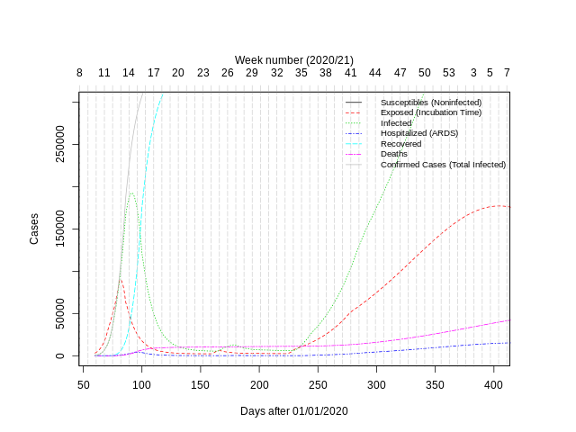
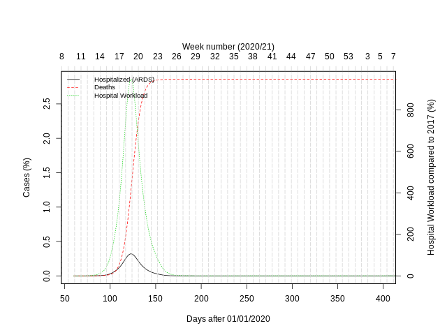

# SimCOVID-19

Simulation of the SARS-CoV-2 pandemic virus outbreak which cause the corona virus disease 2019 (COVID-19) by using a modified S. E. I. R. D. model.
**This repository is currently in a preview state! It should be used with caution!** Currently only German data has been processed, other countries will follow. Further questions can answered by <soeren.thiering@hs-anhalt.de>

## Data

Thanks for sharing the data by Johns Hopkins CSSE (<https://systems.jhu.edu/research/public-health/ncov/>).

## Model

**Parameter:**

| Name                  |         Value | Description                                | Source |
|-----------------------|--------------:|--------------------------------------------|--------|
| $k(t)$                | ~ 0.15 to 0.3 | growth rate                                |        |
| $n_{max}$             |      83019213 | max inahbitants                            |        |
| $t_{e}$               |           5.1 | exposed / incubation time                  |        |
| $t_{i}$               |            12 | time of a moderate  infection              |        |
| $t_{h}$               |             8 | time until hostspitalisation               |        |
| $t_{h,i}$             |            14 | time for hostspitalisation with ARDS       |        |
| $t_{h,d}$             |             2 | time until death                           |        |
| $n_{h,max}$           |         28031 | max intensive beds for treating ARDS       |        |
| $\varphi_{h}$         |          0.14 | propotion hostspitalisation with ARDS      |        |
| $\varphi_{d}(u_h(t))$ |        ~ 0.05 | propotion deaths                           |        |
| $\varphi_{d,min}$     |    0.02282158 | propotion deaths with hostspitalisation    |        |
| $\varphi_{d,max}$     |    0.09687916 | propotion deaths without hostspitalisation |        |

**Growth Rate:**

$$
k(t) =
  \begin{cases}
    k_{i+1}     & \quad \text{ if } t > t_{k,n+1} \\
    k_{i+1}     & \quad \text{ if } t > t_{k,n} \wedge t \leq t_{k,n+1} \\
    \cdots      & \quad \\
    k_{1}       & \quad \text{ if } t > t_{k,1} \wedge t \leq t_{k,2}
  \end{cases}
$$

**Deaths:**

$$
\varphi_{d}(u_h(t))
  \begin{cases}
    \varphi_{d,min} \cfrac {1-u_h(t)} {n_{h,max}} + \varphi_{d,max} \cfrac {u_h(t)} {n_{h,max}}     & \quad \text{ if } \cfrac {u_h(t)} {n_{h,max}} < 1 \\
    \varphi_{d,max}                                                                                 & \quad \text{ if } \cfrac {u_h(t)} {n_{h,max}} \geq 1 \\
  \end{cases}
$$

**Susceptibles:**

$$\cfrac{du_7(t)} {dt} = - k(t) \cfrac{u_7(t)} {n_{max}} u_7(t)$$

**Exposed / Incubating:**

$$\cfrac{du_6(t)} {dt}  =
    + k(t) \cfrac{u_7(t)} {n_{max}} u_6(t)
    - k(t-t_e) \cfrac{u_7(t-t_e)} {n_{max}} u_6(t-t_e)
$$

**Infected:**

$$\cfrac{du_5(t)} {dt}  =
    + k(t-t_e) \cfrac{u_7(t-t_e)} {n_{max}} u_6(t-t_e)
    - k(t-t_e-t_i) \cfrac{u_7(t-t_e-t_i)} {n_{max}} u_6(t-t_e-t_i) (1-\varphi_{h})
    - k(t-t_e-t_h) \cfrac{u_7(t-t_e-t_h)} {n_{max}} u_6(t-t_e-t_h) (\varphi_{h})
$$  

**Hostspitalisation:**

$$\cfrac{du_4(t)} {dt}  =
    + k(t-t_e-t_h) \cfrac{u_7(t-t_e-t_h)} {n_{max}} u_6(t-t_e-t_h) (\varphi_{h})
    - k(t-t_e-t_h-t_{h,i}) \cfrac{u_7(t-t_e-t_h-t_{h,i})} {n_{max}} u_6(t-t_e-t_h-t_{h,i}) (\varphi_{h}-\varphi_{d}(u_4(t-t_{h,i}+t{h,d})))
    - k(t-t_e-t_h-t_{h,d}) \cfrac{u_7(t-t_e-t_h-t_{h,d})} {n_{max}} u_6(t-t_e-t_h-t_{h,d}) \varphi_{d}(u_4(t)))
$$

**Recovered:**

$$
\cfrac{du_3(t)} {dt}  =
    + k(t-t_e-t_i) \cfrac{u_7(t-t_e-t_i)} {n_{max}} u_6(t-t_e-t_i) (1-\varphi_{h})
    + k(t-t_e-t_h-t_{h,i}) \cfrac{u_7(t-t_e-t_h-t_{h,i})} {n_{max}} u_6(t-t_e-t_h-t_{h,i}) (\varphi_{h}-\varphi_{d}(u_4(t-t_{h,i}+t{h,d})))
$$

**Deaths:**

$$
\cfrac{du_2(t)} {dt}  =
    + k(t-t_e-t_h-t_{h,d}) \cfrac{u_7(t-t_e-t_h-t_{h,d})} {n_{max}} u_6(t-t_e-t_h-t_{h,d}) \varphi_{d}(u_4(t)))
$$

**Confirmed:**

$$
\cfrac{du_1(t)} {dt}  =
    + \cfrac{du_2(t)} {dt}
    + \cfrac{du_3(t)} {dt}
    + \cfrac{du_4(t)} {dt}
    + \cfrac{du_5(t)} {dt}
$$

## Results

### Current Situation

The growths rate is determined by logarithmic fitting of the confirmed cases:

Basic Reproductive Number R0 has been determined from growths rate and median incubation time:

$$
R_0 = e^{k  t_e} -1
$$

### Model vs Situation

The predicted begin of a new phase is linked to a real event!

|   Date   |         Event         |        Phase        |       Estimate       |
|----------|-----------------------|---------------------|----------------------|
| 03/01/20 | begin of simulation   | uncontrolled growth |                    0 |
| 03/12/20 | who declares pandemic | social distancing   | 11.713200 (03/12/20) |
| 03/22/20 | contact restriction   | shutdown            | 21.946100 (03/22/20) |

### Forecast (250 Days)

### Scenario 1 no social distancing and no lockdown

The day of health system crash is close to the timepiont the shutdown if an $R_0$ of 1 after shutdown is assumed.

### Scenario 2 exit after day 50 without social distancing (worest case)

### Scenario 3 exit after day 50 with social distancing (better case)

## References

* <https://www.rki.de/DE/Content/InfAZ/N/Neuartiges_Coronavirus/Steckbrief.html>
