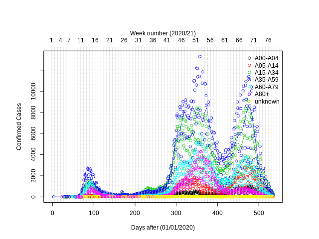
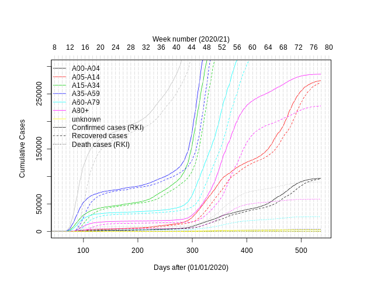
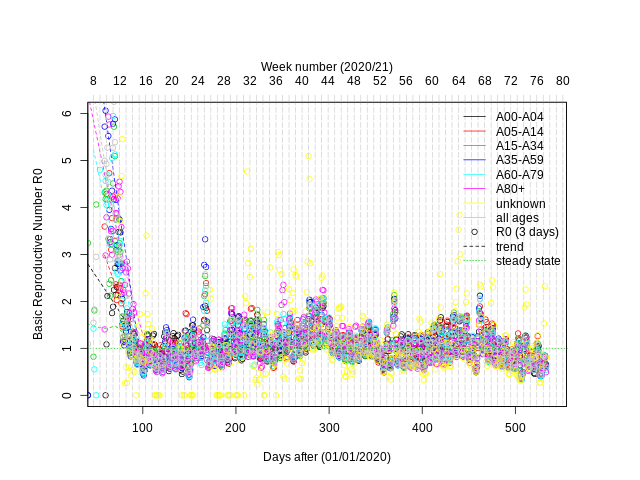
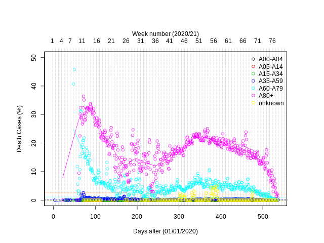
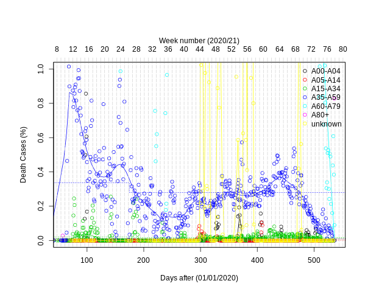
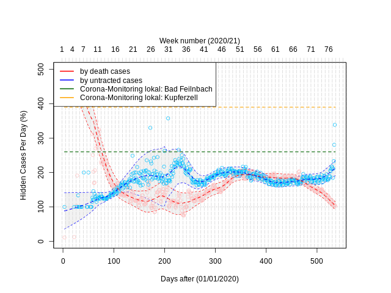
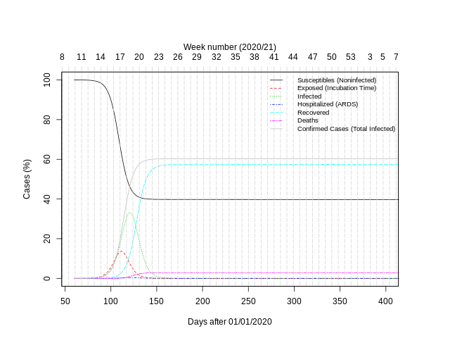
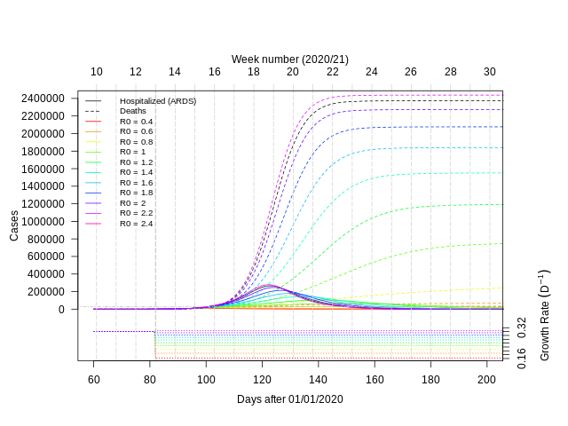

# SimCOVID-19

Simulation of the SARS-CoV-2 pandemic virus outbreak which cause the corona virus disease 2019 (COVID-19) by using a modified S. E. I. R. D. model.
**This repository is currently in a preview state! It should be used with caution!** Currently only German data has been processed, other countries will follow. Further questions can answered by <soeren.thiering@hs-anhalt.de>

## Data

Thanks to esri for sharing the data (<https://opendata.arcgis.com/datasets/dd4580c810204019a7b8eb3e0b329dd6_0.csv>).

## Model

**Parameter:**

| Name                                                                                                            |         Value | Description                                | Source |
|-----------------------------------------------------------------------------------------------------------------|--------------:|--------------------------------------------|--------|
| %24)                                     | ~ 0.15 to 0.4 | growth rate                                |        |
|                            |      83019213 | max inahbitants                            |        |
|                                |           5.1 | exposed / incubation time                  |        |
|                                |            13 | time of a moderate  infection              |        |
|                                |             8 | time until hostspitalisation               |        |
|                          |            10 | time for hostspitalisation with ARDS       |        |
|                        |            10 | time after ARDS                            |        |
|                          |           2.5 | time until death while ARDS                |        |
|                      |         28031 | max intensive beds for treating ARDS       |        |
|                  |          0.14 | propotion hostspitalisation with ARDS      |        |
| )%24) |        ~ 0.05 | propotion deaths                           |        |
|        |    0.02282158 | propotion deaths with hostspitalisation    |        |
|        |    0.09687916 | propotion deaths without hostspitalisation |        |

**Growth Rate:**

%20%3D%5Cbegin%7Bcases%7Dk_%7Bn%2B1%7D%26%20%5Cquad%20%5Ctext%7B%20if%20%7D%20t%20%3E%20t_%7Bk%2Cn%2B1%7D%20%5C%5Ck_%7Bn%7D%26%20%5Cquad%20%5Ctext%7B%20if%20%7D%20t%20%3E%20t_%7Bk%2Cn%7D%20%5Cwedge%20t%20%5Cleq%20t_%7Bk%2Cn%2B1%7D%20%5C%5C%5Ccdots%26%20%5Cquad%20%5C%5Ck_%7B1%7D%26%20%5Cquad%20%5Ctext%7B%20if%20%7D%20t%20%3E%20t_%7Bk%2C1%7D%20%5Cwedge%20t%20%5Cleq%20t_%7Bk%2C2%7D%20%5C%5C%20%5Cend%7Bcases%7D%20%5C%5C)

**Deaths:**

)%20%3D%20%20%20%5Cbegin%7Bcases%7D%20%20%20%20%20%5Cvarphi_%7Bd%2Cmin%7D%20%5Ccfrac%20%7B1-H(t)%7D%20%7Bn_%7Bh%2Cmax%7D%7D%20%2B%20%5Cvarphi_%7Bd%2Cmax%7D%20%5Ccfrac%20%7BH(t)%7D%20%7Bn_%7Bh%2Cmax%7D%7D%20%20%26%20%5Cquad%20%5Ctext%7B%20if%20%7D%20%5Ccfrac%20%7BH(t)%7D%20%7Bn_%7Bh%2Cmax%7D%7D%20%3C%201%20%5C%5C%20%20%20%20%20%5Cvarphi_%7Bd%2Cmax%7D%20%26%20%5Cquad%20%5Ctext%7B%20if%20%7D%20%5Ccfrac%20%7BH(t)%7D%20%7Bn_%7Bh%2Cmax%7D%7D%20%5Cgeq%201%20%5C%5C%20%20%20%5Cend%7Bcases%7D)

**Susceptibles:**

%20%3D%20-%20k(t)%20%5Ccfrac%7BS(t)%7D%20%7Bn_%7Bmax%7D%7D%20S(t))

**Exposed / Incubating:**

%20%3D%20-%20S%27(t)%20%2B%20S%27(t-t_e))

**Infected:**

%20%3D%20-%20S%27(t%20-%20t_%7Be%7D)%20%2B%20S%27(t%20-%20t_%7Be%7D%20-%20t_%7Bi%7D)%20(1-%5Cvarphi_%7Bh%7D)%20%2B%20S%27(t%20-%20t_%7Be%7D%20-%20t_%7Bh%7D)%20%5Cvarphi_%7Bh%7D%20-%20S%27(t%20-%20t_%7Be%7D%20-%20t_%7Bh%7D%20-%20t_%7Bh%2Ci%7D)%20(%5Cvarphi_%7Bh%7D%20-%20%5Cvarphi_%7Bd%7D(H(t%20-%20t_%7Bh%2Ci%7D%20%2B%20t_%7Bh%2Cd%7D)))%20%2B%20S%27(t%20-%20t_%7Be%7D%20-%20t_%7Bh%7D%20-%20t_%7Bh%2Ci%7D%20-%20t_%7Bh%2Cii%7D)(%5Cvarphi_%7Bh%7D%20-%20%5Cvarphi_%7Bd%7D(H(t%20-%20t_%7Bh%2Ci%7D%20%2B%20t_%7Bh%2Cd%7D%20-%20t_%7Bh%2Cii%7D))))

**Hostspitalisation:**

%20%3D%20-%20S%27(%20t%20-%20t_%7Be%7D%20-%20t_%7Bh%7D)%20%20%5Cvarphi_%7Bh%7D%20%20%2B%20S%27(%20t%20-%20t_%7Be%7D%20-%20t_%7Bh%7D%20-%20t_%7Bh%2Ci%7D)%20(%5Cvarphi_%7Bh%7D%20-%20%5Cvarphi_%7Bd%7D(H(%20t%20-%20t_%7Bh%2Ci%7D%20%2B%20t_%7Bh%2Cd%7D)))%20%2B%20S%27(%20t%20-%20t_%7Be%7D%20-%20t_%7Bh%7D%20-%20t_%7Bh%2Cd%7D)%20%5Cvarphi_%7Bd%7D(H(t)))

**Recovered:**

%20%3D%20-%20S%27(%20t%20-%20t_%7Be%7D%20-%20t_%7Bi%7D)%20%20(1-%5Cvarphi_%7Bh%7D)%20-%20S%27(%20t%20-%20t_%7Be%7D%20-%20t_%7Bh%7D%20-%20t_%7Bh%2Ci%7D%20-%20t_%7Bh%2Cii%7D)%20(%5Cvarphi_%7Bh%7D%20-%20%5Cvarphi_%7Bd%7D(H(%20t%20-%20t_%7Bh%2Ci%7D%20%2B%20t_%7Bh%2Cd%7D%20-%20t_%7Bh%2Cii%7D))))

**Deaths:**

%20%3D%20-%20S%27(%20t%20-%20t_%7Be%7D%20-%20t_%7Bh%7D%20-%20t_%7Bh%2Cd%7D)%20%20%5Cvarphi_%7Bd%7D(H(t)))

**Confirmed:**

%20%3D%20%2B%20D%27(t)%20%2B%20R%27(t)%20%2B%20H%27(t)%20%2B%20I%27(t))

## Results

### Current Situation

#### Confirmed Cases

#### Cumulative

#### Basic Reproductive Number R0

R0 has been determined by the nowcast method:

#### Death Cases

#### Hidden Cases

Hidden cases are calculated by the amount of death cases by untractable. 

### Model vs Situation

The predicted begin of a new phase is linked to a real event!

|   date   |                   event                |        phase        |        estimated date       | estimated growth rate |
|----------|----------------------------------------|---------------------|-----------------------------|-----------------------|
| 03/01/20 | begin of simulation                    | uncontrolled growth |                0 (03/01/20) |     0.343451529740432 |
| 03/12/20 | who declares pandemic                  | social distancing   | 11.6044817950348 (03/12/20) |     0.250465928149758 |
| 03/22/20 | contact restriction                    | shutdown            | 21.8496919557852 (03/22/20) |     0.182463773528515 |
| 04/22/20 | mask requirement in all federal states |                     | 52.5601657052918 (04/22/20) |     0.189752082935843 |
| 04/30/20 | end of shutdown                        | re open             | 61.9761514250585 (05/01/20) |     0.168857144604232 |
| 06/18/20 | endemic outbreak in Gütersloh          | begin               | 100.554708779522 (06/09/20) |     0.208644178682707 |
|          |                                        | end                 | 110.981269331214 (06/19/20) |     0.155656851503377 |
| 07/06/20 | begin of school vacations I            | 2nd phase           | 126.120822599879 (07/05/20) |     0.188918924378758 |
| 07/16/20 | begin of school vacations II           |                     | 135.397220216076 (07/14/20) |     0.21519268465177  |

### Forecast (250 Days)

### Scenario 1 - no social distancing and no lock down

The day of health system crash is close to the time point the shutdown if an  of 1 after shutdown is assumed.

### Scenario 2 - End of lock down after day 50 without social distancing (worst case)

### Scenario 3 - End of lock down after day 50 with social distancing (better case)

## References

* <https://www.rki.de/DE/Content/InfAZ/N/Neuartiges_Coronavirus/Steckbrief.html>
* <https://www.rki.de/DE/Content/InfAZ/N/Neuartiges_Coronavirus/Projekte_RKI/R-Wert-Erlaeuterung.pdf?__blob=publicationFile>
* <https://www.rki.de/DE/Content/Gesundheitsmonitoring/Studien/cml-studie/Factsheet_Bad_Feilnbach.html>
* <https://www.recoverytrial.net/files/recovery_dexamethasone_statement_160620_v2final.pdf>
* <https://jamanetwork.com/journals/jama/fullarticle/2762130>
* <https://experience.arcgis.com/experience/478220a4c454480e823b17327b2bf1d4>
